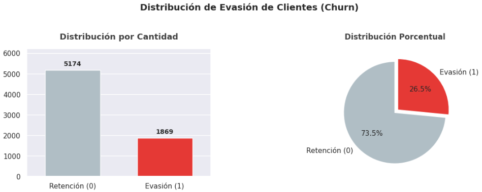
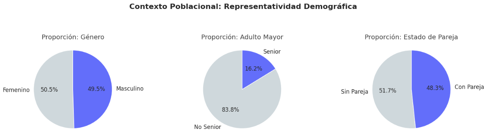
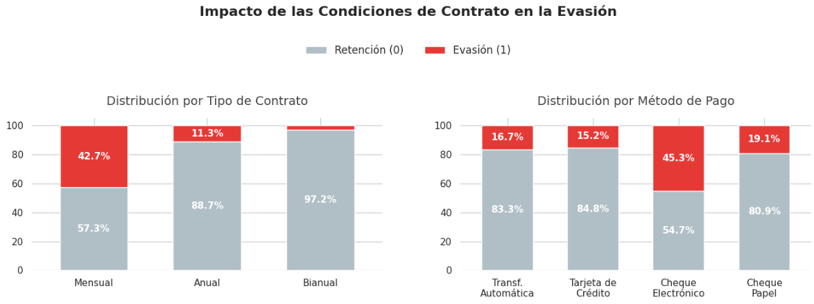
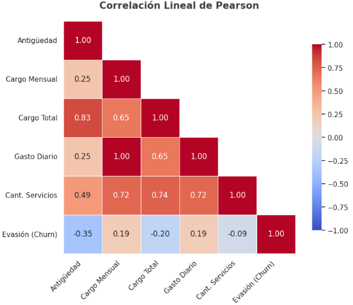
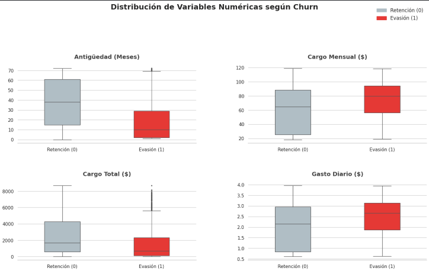

<h1 align="center">📊 Challenge TelecomX - Análisis de Evasión de Clientes</h1>

<p align="center">
  
  
  
  
  
  
  
</p>

<p align="center">
  🔗 <a href="https://github.com/Aiello-M/Challenge-TelecomX" target="_blank">Ver repositorio</a> 
  <a href="https://colab.research.google.com/github/Aiello-M/Challenge-TelecomX/blob/main/Challenge-TelecomX.ipynb" target="_blank">Abrir Notebook en Colab</a>
</p>

---

## 📚 Sobre el Challenge

**Challenge**: Este desafío forma parte del curso de especialización en Data Science de [Alura Latam](https://www.aluracursos.com/)

**Programa**: Oracle Next Education (ONE) - G9 en colaboración con Alura Latam

**Formación**: Fundamentos de Python y Datos G9 - ONE

---

## 📝 Descripción General

El proyecto **TelecomX** aborda el análisis de evasión de clientes (churn) de una empresa de telecomunicaciones que enfrenta una tasa crítica de abandono del **26.5%**. El objetivo es identificar los factores determinantes que llevan a los clientes a cancelar sus servicios, proporcionando insights accionables para reducir la tasa de evasión.

### 🎯 Objetivo

Realizar un **análisis exploratorio de datos (EDA)** completo para:

1. **🔍 Identificar patrones** de comportamiento en clientes que abandonan vs. retienen
2. **📊 Cuantificar el impacto** de variables demográficas, comerciales y económicas
3. **💡 Proporcionar insights estratégicos** basados en datos
4. **📋 Generar recomendaciones** priorizadas para reducir el churn

---

## 🗂️ Estructura del Proyecto

```
Challenge-TelecomX-DataScience/
│
├── Challenge_TelecomX.ipynb        # Notebook principal con análisis completo
├── README.md                        # Documentación del proyecto
├── assets/                          # Imágenes para documentación
│   ├── perfil.jpg                   # Foto de perfil
│   ├── logo_alura.png               # Logo de Alura
│   ├── img1.png                     # Gráfico distribución churn
│   ├── img2.png                     # Análisis demográfico
│   ├── img3.png                     # Análisis de contratos
│   ├── img4.png                     # Matriz de correlación
│   └── img5.png                     # Distribución variables numéricas
│
└── datos/                           # Dataset
    └── TelecomX_Data.json           # Datos extraídos de la API
```

---

## 🔍 Metodología del Análisis

El proyecto sigue un proceso estructurado de **ETL (Extract, Transform, Load)** y análisis exploratorio:

### **Fase 1: 📥 Extracción de Datos**

- **Fuente**: API de TelecomX (`TelecomX_Data.json`)
- **Estructura**: JSON anidado de 4 niveles (customer, phone, internet, account)
- **Volumen inicial**: 7,267 registros × 21 variables
- **Técnica**: Normalización con `pd.json_normalize()` para convertir a formato tabular

### **Fase 2: 🔧 Transformación de Datos**

**Pasos ejecutados:**

1. **Renombramiento**: Aplicación de nomenclatura `snake_case` (estándar PEP 8)
2. **Detección de inconsistencias**:
   - 224 registros con valores vacíos en `churn` (3%)
   - 11 registros con `total_charges` vacío (0.15%)
   - 0 duplicados ✅
   - 0 valores nulos ✅

3. **Corrección de datos**:
   - Eliminación de registros con `churn` vacío (variable objetivo)
   - Reemplazo de `total_charges` vacíos por `0` (clientes nuevos)

4. **Creación de variables**:
   - `charges_daily`: Cargo diario aproximado (monthly_charges / 30)
   - `cantidad_servicios`: Suma de servicios adicionales de internet contratados (seguridad online, backup, protección dispositivo, soporte técnico, TV streaming, películas streaming)

5. **Estandarización**:
   - Conversión de 6 variables binarias (Yes/No, Female/Male) a formato numérico (1/0)

**Dataset limpio final**: 7,043 clientes × 23 variables

---

### **Fase 3: 📊 Análisis Exploratorio de Datos (EDA)**

El análisis se estructuró en 5 componentes:

#### **3.1 Análisis Descriptivo General**
- Estadísticas de tendencia central y dispersión
- **Hallazgo clave**: Tasa de evasión del 26.54% (1,869 de 7,043 clientes)

#### **3.2 Distribución de Churn**
- Visualización de proporción de clientes retenidos (73.5%) vs. abandonados (26.5%)
- Comparación con estándares de la industria

#### **3.3 Análisis por Variables Categóricas**
Se analizaron 6 variables categóricas identificando **3 factores CRÍTICOS**:

| Factor | Segmento de Alto Riesgo | Tasa de Churn |
|--------|-------------------------|---------------|
| **Tipo de Contrato** | Month-to-month | **42.7%** |
| **Servicio Internet** | Fibra Óptica | **41.9%** |
| **Método de Pago** | Cheque Electrónico | **45.3%** |

#### **3.4 Análisis por Variables Numéricas**
Comparación de promedios entre clientes que abandonaron vs. retuvieron:

| Variable | No abandonó | Abandonó | Diferencia |
|----------|-------------|----------|------------|
| **Antigüedad** | 38 meses | 18 meses | **-20 meses** |
| **Cargo mensual** | $61.27 | $74.44 | **+$13.17** |
| **Cargo total** | $2,555 | $1,531 | **-$1,024** |

#### **3.5 Análisis de Correlación**
- **Antigüedad (tenure)**: Correlación negativa moderada (-0.35) con churn
- **Cargo mensual**: Correlación positiva débil (+0.19) con churn
- **Cantidad de servicios**: Correlación negativa débil (-0.09) con churn
- Confirmación: Primeros 12 meses son período crítico de retención
- Hallazgo adicional: Más servicios contratados reducen levemente el churn

---

## 📷 Visualizaciones Destacadas

<table>
  <tr>
    <td align="center">
      <strong>📊 Distribución de Churn</strong><br>
      
      <br><sub>26.5% de evasión</sub>
    </td>
    <td align="center">
      <strong>👥 Perfil Demográfico</strong><br>
      
      <br><sub>Contexto poblacional</sub>
    </td>
  </tr>
  <tr>
    <td align="center">
      <strong>📋 Análisis de Contratos</strong><br>
      
      <br><sub>Month-to-month: 42.7% churn</sub>
    </td>
    <td align="center">
      <strong>🔗 Matriz de Correlación</strong><br>
      
      <br><sub>Antigüedad: factor clave</sub>
    </td>
  </tr>
  <tr>
    <td align="center" colspan="2">
      <strong>📦 Distribución de Variables Numéricas</strong><br>
      
      <br><sub>Comparación tenure, monthly_charges, total_charges, charges_daily</sub>
    </td>
  </tr>
</table>

---

## 💡 Insights Clave

### 🎯 Perfil de Cliente de ALTO RIESGO

El análisis revela un **patrón claro** de evasión:

✅ **Características identificadas:**
- Cliente **nuevo** (menos de 12 meses de antigüedad)
- Contrato **mensual** (month-to-month)
- Servicio de **fibra óptica** (premium)
- Método de pago: **cheque electrónico**
- Cargo mensual **elevado** ($70+)

**Tasa de churn estimada**: >60% (combinación de factores críticos)

---

### 📌 Hallazgos Estratégicos

**1. Antigüedad del Cliente**
- **Los primeros 12 meses representan el 65% de la evasión total**
- Período crítico: Meses 1-6 (pico máximo de abandono)

**2. Estructura de Contratos**
- Contratos mensuales generan **15 veces más churn** que bianuales
- Oportunidad perdida de retención a largo plazo

**3. Servicio Premium (Fibra Óptica)**
- Tasa de churn más alta (42%) a pesar de ser el servicio más caro
- Sugiere **desajuste entre precio y percepción de valor**

**4. Método de Pago**
- Pagos automáticos reducen el churn en **3 veces**
- Cheque electrónico (45% churn) es el método más problemático

---

## 🎯 Recomendaciones Estratégicas

Con base en los datos analizados, se proponen las siguientes iniciativas estratégicas priorizadas por impacto esperado:

### **🔴 Prioridad ALTA** (impacto estimado: 10-15 puntos de reducción en churn)

**1. Auditar la Experiencia Inicial**
- Revisar qué está fallando en los procesos de instalación y atención durante los primeros 30 días
- Prestar especial atención a nuevos usuarios de Fibra Óptica para asegurar que reciban la calidad prometida

**2. Promover Contratos Anuales**
- Ofrecer promociones o descuentos a nuevos clientes y usuarios en modalidad mensual
- Motivar el cambio hacia contratos de 1-2 años

---

### **🟡 Prioridad MEDIA** (impacto estimado: 5-8 puntos de reducción en churn)

**3. Impulsar la Automatización de Pagos**
- Incentivar a usuarios con Cheque Electrónico a migrar a débito automático o tarjeta de crédito
- Los datos muestran que automatizar el cobro reduce enormemente las cancelaciones

**4. Ofrecer Servicios Adicionales**
- Armar paquetes atractivos que incluyan servicios extra (seguridad online, backup, TV)
- Aumentar el valor percibido y disminuir la posibilidad de abandono

---

## 🛠️ Tecnologías Utilizadas

- **Google Colab** – Entorno de desarrollo en la nube
- **Python 3.8+** – Lenguaje de programación
- **Pandas** – Manipulación y análisis de datos
- **Matplotlib** – Visualización de datos
- **Seaborn** – Gráficos estadísticos avanzados
- **NumPy** – Operaciones numéricas
- **Requests** – Extracción de datos desde API

---

## 🚀 Cómo Ejecutar el Proyecto

### Opción 1: Google Colab (Recomendado)
1. Abre el [notebook en Colab](https://github.com/Aiello-M/Challenge-TelecomX.git)
2. Click en **"Copiar en Drive"**
3. Ejecuta todas las celdas: `Runtime` → `Run all`

### Opción 2: Jupyter Notebook Local
```bash
# Clonar repositorio
git clone https://github.com/Aiello-M/Challenge-TelecomX.git

# Navegar al directorio
cd Challenge-TelecomX

# Instalar dependencias
pip install pandas matplotlib seaborn numpy requests

# Abrir notebook
jupyter notebook Challenge_TelecomX.ipynb
```

---

## 📂 Fuente de Datos

**API de TelecomX:**
```
https://raw.githubusercontent.com/ingridcristh/challenge2-data-science-LATAM/main/TelecomX_Data.json
```

**Estructura del JSON:**
- 7,267 registros de clientes
- 21 variables (demográficas, contractuales, facturación, churn)
- Formato anidado de 4 niveles

---

## ✒️ Autora

| [<br><sub>Mariana Aiello</sub>](https://github.com/Aiello-M) |
| :---: |

---

## 📝 Licencia

Este proyecto es de código abierto y está disponible bajo la licencia MIT.

---

<p align="center">
  Desarrollado con 💙 como parte del programa Oracle Next Education (ONE) - G9
</p>
